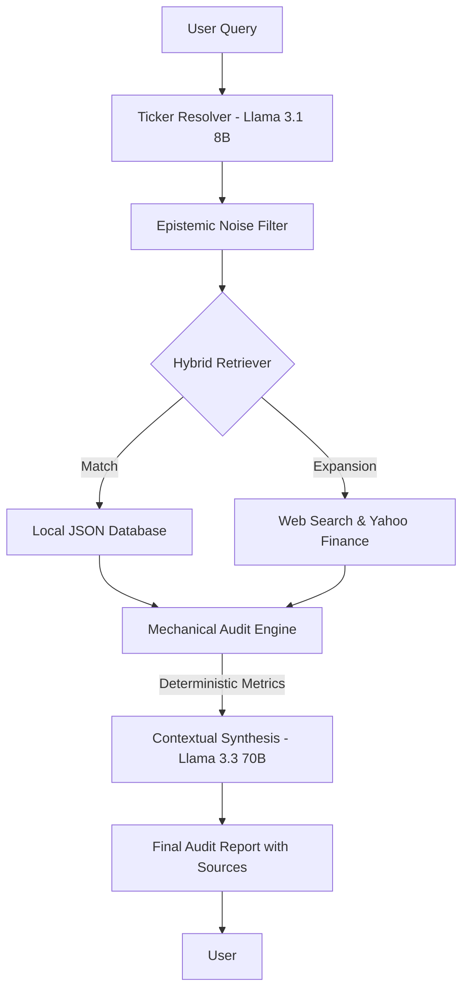

# Financial Auditor LLM (Hybrid RAG)

**Structural Integrity Audit & Epistemic Reasoning System for Global Public Companies**

Financial Auditor LLM is an advanced financial audit instrument built on a **Hybrid Retrieval-Augmented Generation (RAG)** architecture.  
The system is designed to perform *clinical-grade audits* of global public companies by synthesizing structured internal financial data with real-time external market intelligence.

---
## Application Interface

---

  

*Main system interface displaying clinical audit results alongside verifiable evidence.*

---

## Live Demo
You can access the live application here:  
**[Financial Auditor LLM Live App](https://finance-auditor-llm-evhdntwf6p4nsb47ip2y2y.streamlit.app/)**

> **Note:** This system is optimized for **Desktop display**. Mobile support is currently limited; please use a desktop browser for the best experience.

## Project Overview

The system validates financial integrity by combining two primary data sources:

1. **Internal Data**  
   Structured JSON files containing historical financial records and accounting proofs.

2. **External Data**  
   - Real-time web research via the Tavily API  
   - Fundamental market data retrieved through the Yahoo Finance API

The system detects financial anomalies, decomposes profitability structures, and produces audit conclusions accompanied by **explicit Sources & Evidence**, enabling human re-verification (*auditor-in-the-loop*).

---

## System Architecture

The workflow is intentionally rigid to prevent numerical hallucination and ensure epistemic discipline.

## Pipeline Explanation
1. **User Query & Ticker Resolution :**
    Automatically identifies the correct public company ticker from natural language input.

2.  **Epistemic Noise Filter :**
    Removes speculative elements such as market hype, sentiment, and investment recommendations.

3.  **Hybrid Retriever :**
    Searches the local structured database and expands retrieval through live web queries when necessary.

4.  **Deterministic Mechanical Audit Engine :**
    Performs all mathematical computations outside the LLM to guarantee numerical accuracy.

5.  **Contextual Synthesis (Llama-3.3-70B) :**
    Interprets deterministic results using up-to-date market context under strict governance rules.

6.  **Final Audit Report :**
    Outputs conclusions with explicit citations and internal evidence references.

## System Advantages
1. **Epistemic Integrity :**
    Strict separation between Observed data (directly retrieved financial facts) and Inferred data (logical deductions derived from observed data)

2.  **Anti-Hype Guardrails :**
    Explicit filtering mechanisms isolate speculative media narratives from verifiable fundamentals.

3.  **Contextual Ratios**
    Financial ratios are interpreted relative to:
    - Asset intensity
    - Industry norms, rather than presented as raw, context-free figures.

4.  **Falsifiability**
    Every claim is accompanied by traceable sources, enabling independent verification.

## Key Features
1. **Multi-Layered Epistemic Governance**
 Ensures information integrity through an Evidence Hierarchy, where fundamental data is given the highest weight (1.0) while news context is given lower weight (0.5).

2. **Deterministic Financial Audit Engine**
  - Deep Fundamentals Extraction: Precise extraction of balance sheet and income statement metrics from Yahoo Finance.

  - DuPont Structural Analysis: Deconstructs ROA into Asset Turnover and Net Margin to detect pricing power.

  - Denominator Integrity Audit: Evaluates whether the business model is Asset-Light or Integrated.

3. **Mechanical Stress Testing & Normalization**
  - Normalization Test: Computes Normalized ROA by forcing capital intensity to the industry median.

  - Integrity Risk Rating: Assigns risk classifications (e.g., HIGH, STABLE) based on mechanical downside exposure.

## Scope Limitation
The system is currently optimized specifically for auditing global public companies (NYSE/NASDAQ) that have extensive financial report documentation (10-K/10-Q) available on the internet.
